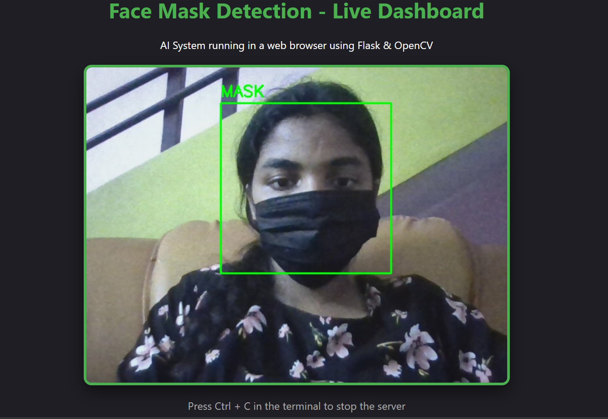
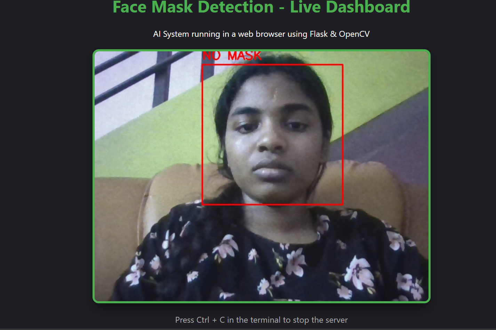
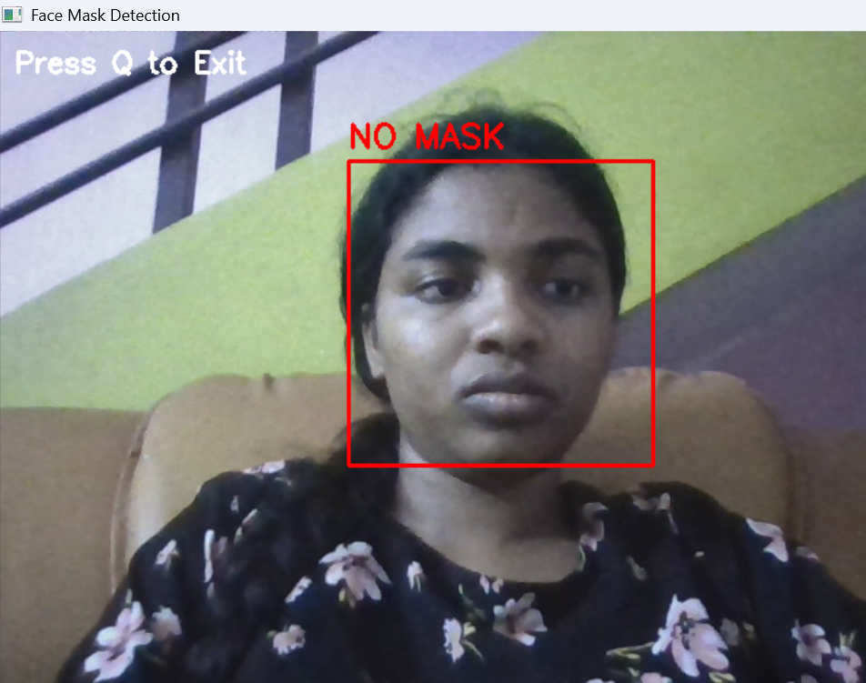

# 😷 Face Mask Detection using CNN

A real-time **Face Mask Detection System** developed using **Python**, **TensorFlow**, **Keras**, **OpenCV**, and **Flask**. The system detects whether a person is wearing a face mask through a webcam and provides **real-time visual alerts** along with **voice and beep notifications** when no mask is detected.

---

## 📌 Features

- ✅ Real-time face mask detection using webcam
- ✅ CNN-based deep learning model
- ✅ Detects **Mask** and **No Mask**
- ✅ Green bounding box for Mask detected
- ✅ Red bounding box for No Mask detected
- ✅ Voice alert in English
- ✅ Beep warning sound
- ✅ Flask web interface for live video streaming
- ✅ Real-time prediction using trained model

---

## 🛠️ Technologies Used

- Python
- TensorFlow
- Keras
- OpenCV
- Flask
- NumPy
- Pyttsx3
- Scikit-learn

---

## 📂 Dataset

This project uses the **Face Mask Detection Dataset** from **Kaggle**.

Dataset contains two classes:

- With Mask
- Without Mask

Approximately **3900+ images** are available for each class.

---

## 📁 Project Structure

```
FaceMaskDetection/
│
├── app.py
├── detect.py
├── train_model.py
├── test_model.py
├── mask_model.h5
├── requirements.txt
├── README.md
│
├── templates/
│   └── index.html
│
├── static/
│   ├── style.css
│   └── script.js
│
├── screenshots/
│   ├── home.png
│   ├── mask_detected.png
│   ├── no_mask_detected.png
│   └── dashboard.png
│
└── data/
    ├── with_mask/
    └── without_mask/
```

---

## ⚙️ Installation

### Clone Repository

```bash
git clone https://github.com/Preetha-analyst/FaceMaskDetection.git
```

### Move into Project

```bash
cd FaceMaskDetection
```

### Install Dependencies

```bash
pip install -r requirements.txt
```

---

## ▶️ Train the Model

```bash
python train_model.py
```

This generates:

```
mask_model.h5
```

---

## 🧪 Test the Model

```bash
python test_model.py
```

Example Output

```
Prediction Value: 0.000138

MASK
```

or

```
Prediction Value: 0.982341

NO MASK
```

---

## 🎥 Run Desktop Application

```bash
python detect.py
```

Features:

- Webcam Detection
- Green Box → Mask
- Red Box → No Mask
- Voice Alert
- Beep Alert

---

## 🌐 Run Flask Application

```bash
python app.py
```

Open Browser

```
http://127.0.0.1:5000
```

---

## 📸 Output

### Home Dashboard

```

 

```
---

### Mask Detected

```

```

---

### No Mask Detected

```

```

---

### Flask Live Detection

```

```

---

## 🔔 Alert System

When **No Mask** is detected:

- 🔴 Red Bounding Box
- 🔊 Beep Sound
- 🎙️ Voice Alert

Voice Message:

> "Warning. No mask detected. Please wear your face mask."

---

## 🎯 Future Enhancements

- Face recognition integration
- Mobile application
- Attendance system
- Cloud deployment
- Multiple face tracking
- Email alert system

---

## 👩‍💻 Author

**Preetha S**

GitHub:
https://github.com/Preetha-analyst

---

## ⭐ Support

If you like this project, please ⭐ the repository.
